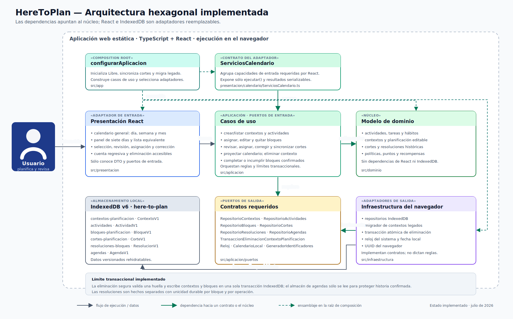
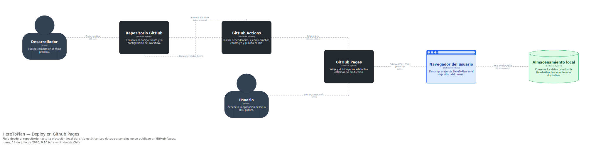

# Contrato de arquitectura de HereToPlan

## 1. Decisión arquitectónica

HereToPlan adopta una **arquitectura hexagonal**, también denominada arquitectura de puertos y adaptadores. El código se distribuye en directorios que pueden parecer capas, pero su propiedad esencial no es el orden vertical de esas carpetas: es la protección del núcleo y la dirección de las dependencias.

El dominio y los casos de uso constituyen el interior de la aplicación. React, el navegador, la persistencia y cualquier integración futura son mecanismos externos conectados mediante adaptadores. El núcleo no conoce esos mecanismos ni depende de ellos.

La formulación precisa para este proyecto es:

> Arquitectura hexagonal con separación interna entre aplicación y dominio, y con composición explícita de adaptadores.

No se utilizará «arquitectura en capas» como denominación principal. Presentación, aplicación, dominio e infraestructura describen responsabilidades organizativas, pero los contratos entre ellas siguen el modelo de puertos y adaptadores.

## 2. Vistas arquitectónicas

### 2.1. Componentes: puertos y adaptadores

La vista `Componentes` representa el hexágono lógico, los puertos y los adaptadores definidos para HereToPlan.



### 2.2. Despliegue: GitHub Actions y GitHub Pages

La vista `Despliegue` muestra cómo el código pasa del repositorio al sitio público y dónde se ejecuta la aplicación. El almacenamiento personal permanece en el navegador y no forma parte de los artefactos publicados.



#### Contrato de entrega continua

El workflow de GitHub Actions separa dos responsabilidades:

1. `calidad` restaura el lockfile, comprueba formato y arquitectura, ejecuta las
   pruebas con cobertura, construye `dist/` y valida sus referencias estáticas;
2. `desplegar` solo se ejecuta para cambios aceptados en `main`, depende del job
   de calidad y publica exactamente el artefacto producido por este.

El workflow posee permiso de lectura del contenido por defecto. Únicamente el
job de despliegue obtiene `pages: write` e `id-token: write`, necesarios para la
publicación mediante GitHub Pages.

Vite construye con `base: "/HereToPlan/"` porque el sitio pertenece a un
repositorio de proyecto y no al dominio raíz de la cuenta. La navegación usa
`HashRouter`: GitHub Pages siempre entrega el mismo `index.html` y la porción
posterior a `#` se resuelve en el navegador. Las rutas públicas son
`#/calendario`, `#/crear`, `#/puntos` y `#/respaldo`; no requieren reglas de
fallback del servidor.

## 3. Conceptos fundamentales

### Núcleo

El núcleo contiene decisiones propias de HereToPlan y se divide en dos zonas:

- **Dominio:** entidades, objetos de valor, agregados, servicios de dominio e invariantes.
- **Aplicación:** casos de uso, coordinación transaccional y definición de los puertos necesarios para interactuar con el exterior.

La aplicación puede depender del dominio. El dominio no depende de la aplicación.

### Puerto

Un puerto es un contrato definido desde la perspectiva del núcleo. Describe una capacidad sin imponer el mecanismo que la ejecuta.

Existen dos clases:

- **Puertos de entrada:** operaciones que la aplicación ofrece a actores externos; normalmente se materializan como casos de uso o interfaces de comandos y consultas.
- **Puertos de salida:** capacidades que los casos de uso necesitan del entorno, como repositorios, reloj, generación de identificadores, unidad de trabajo o almacenamiento de respaldos.

Un puerto no contiene lógica de interfaz gráfica ni detalles de persistencia.

### Adaptador

Un adaptador traduce entre una tecnología externa y un puerto del núcleo:

- React es un **adaptador de entrada**: convierte interacciones del usuario en llamadas a casos de uso y transforma resultados en vistas.
- La persistencia local es un **adaptador de salida**: implementa contratos solicitados por aplicación y traduce agregados a datos almacenables.

### Composición

`app/` es la raíz de composición. Crea adaptadores concretos, construye casos de uso y entrega los puertos de entrada preparados a la presentación. Es el único lugar que puede conocer simultáneamente implementaciones del núcleo y de infraestructura.

La composición no debe contener reglas del negocio.

## 4. Mapa del código

```text
src/
├── app/              # raíz de composición
├── presentacion/     # adaptadores de entrada React
├── aplicacion/       # casos de uso y puertos
├── dominio/          # modelo e invariantes del negocio
└── infraestructura/  # adaptadores de salida
```

Esta estructura física sirve a la arquitectura hexagonal; no establece una cadena descendente del tipo presentación → negocio → base de datos.

| Directorio         | Papel hexagonal        | Puede depender de                            |
| ------------------ | ---------------------- | -------------------------------------------- |
| `dominio/`         | Núcleo de dominio      | Código compartido del propio dominio         |
| `aplicacion/`      | Casos de uso y puertos | Dominio                                      |
| `presentacion/`    | Adaptador de entrada   | Puertos de entrada y DTO de aplicación       |
| `infraestructura/` | Adaptadores de salida  | Puertos de salida y tipos mínimos necesarios |
| `app/`             | Composición            | Todas las zonas para ensamblarlas            |

## 5. Regla de dependencias

Las dependencias de código fuente apuntan hacia el núcleo:

```text
Usuario
   ↓
Adaptador de entrada (React)
   ↓
Puerto de entrada / caso de uso
   ↓
Aplicación → Dominio
   ↑
Puerto de salida
   ↑
Adaptador de salida (infraestructura)
```

Reglas obligatorias:

1. `dominio/` no importa React, Vite, APIs del navegador, persistencia, aplicación ni infraestructura.
2. `aplicacion/` no importa componentes React ni adaptadores concretos.
3. Los puertos de salida se definen en el núcleo, no en infraestructura.
4. `presentacion/` invoca puertos de entrada; no accede directamente a repositorios o almacenamiento.
5. `infraestructura/` implementa puertos de salida; no dirige el flujo del negocio.
6. `presentacion/` e `infraestructura/` no se importan entre sí.
7. `app/` ensambla dependencias, pero no decide políticas del dominio.
8. Una librería externa solo puede entrar al dominio cuando representa una necesidad intrínseca, no una comodidad técnica; por defecto debe permanecer fuera.

## 6. Contratos arquitectónicos

Los puertos se incorporarán cuando un caso de uso real los necesite. El diseño establece los siguientes contratos:

### Puertos de entrada

- crear o modificar un contexto de planificación nombrado;
- asignar actividades a bloques dentro de `Libre` o de un contexto nombrado;
- preparar y confirmar un corte de planificación;
- completar o incumplir un bloque;
- consultar agenda e historial;
- preparar y confirmar un canje de recompensa.
- iniciar, pausar, reanudar, detener y consultar sesiones de cronómetro.
- consultar, acreditar y consumir minutos del banco de recuperación.
- exportar el estado persistente y analizar un respaldo sin importarlo.

### Puertos de salida

- repositorio de actividades;
- repositorio de agendas;
- repositorio de contextos de planificación;
- repositorio de resoluciones de bloques;
- repositorio de billetera y transacciones;
- repositorio de canjes;
- repositorio de sesiones de cronómetro;
- repositorio de movimientos de recuperación y reducciones de carga;
- unidad de trabajo para confirmación atómica;
- reloj;
- generador de identificadores;
- lector consistente del estado persistente para respaldo.

Esta lista no autoriza a implementar contratos anticipadamente. Un puerto existe para servir a un caso de uso, no para completar una plantilla arquitectónica.

### 6.1. Primer contrato de entrada

`CrearAgendaBorrador` recibe un comando formado por valores primitivos y devuelve
un resultado discriminado. El resultado exitoso contiene una representación de
lectura inmutable; nunca entrega la entidad `Agenda` a presentación. Los rechazos
esperados se expresan mediante códigos estables y pueden señalar el campo de
entrada correspondiente.

El comando no recibe identificadores ni instantes. Estas dos decisiones pertenecen
al caso de uso y se obtienen mediante los puertos `GeneradorIdentificadores` y
`Reloj`, lo que permite controlar ambos valores durante las pruebas.

### 6.2. Semántica de `RepositorioAgendas`

El puerto contiene únicamente las operaciones requeridas por el primer caso de
uso:

| Operación          | Semántica contractual                                                                                                                               |
| ------------------ | --------------------------------------------------------------------------------------------------------------------------------------------------- |
| `guardar(agenda)`  | Registra una agenda nueva. Si el identificador ya existe, rechaza con `ErrorAgendaDuplicada` y conserva intacta la agenda anterior.                 |
| `obtenerPorId(id)` | Recupera la agenda asociada o devuelve `undefined` cuando no existe. No garantiza identidad de referencia entre el objeto guardado y el recuperado. |

La suite `verificarContratoRepositorioAgendas` expresa estas reglas una sola vez.
Los adaptadores en memoria e IndexedDB ejecutan la misma suite. Los fallos
técnicos se propagan como errores; la ausencia de una agenda no se considera un
fallo.

### 6.3. Registro persistido `AgendaV1`

La persistencia utiliza una representación distinta del agregado. `AgendaV1` es
un registro plano, serializable y con `versionEsquema: 1`; no contiene instancias
de clases del dominio.

- Las fechas civiles se almacenan como `YYYY-MM-DD` y nunca se convierten en
  instantes.
- Los eventos históricos se almacenan como cadenas ISO UTC normalizadas.
- Los bloques conservan actividad, duración, política, estado y resolución.
- Los ajustes conservan su canje de origen y el instante de aplicación.
- Confirmación y finalización son opcionales según el estado de la agenda.

`convertirAgendaEnV1` produce el registro sin exponer referencias mutables del
agregado. `rehidratarAgendaDesdeV1` convierte los valores y utiliza las fábricas
de rehidratación del dominio. No reproduce operaciones históricas como
`confirmar`, `completarBloque` o `aplicarAjustes`.

La rehidratación valida nuevamente la coherencia interna: estados y timestamps,
rangos de bloques, duplicados y la correspondencia entre cada bloque excusado y
su ajuste. Una versión desconocida o un registro incoherente se rechaza sin
producir una agenda parcial.

#### Evolución desde `AgendaV1`

`AgendaV1` refleja la frontera inicial, en la que una agenda reúne contexto,
bloques y ciclo de confirmación. La evolución no reinterpreta ese registro ni le
añade campos con otra semántica: incorpora `ContextoPlanificacionV1` como un
contrato persistido independiente.

La migración implementada es incremental. En una transacción sobre `agendas` y
`contextos-planificacion`, valida primero todos los registros y luego:

1. crea una única instancia de `Libre`, administrada por el sistema;
2. proyecta cada `AgendaV1` válida como máximo una vez a un contexto nombrado
   con el mismo identificador, nombre, rango e instante de creación;
3. conserva íntegro cada `AgendaV1`, incluidos bloques, política, estado,
   confirmación, finalización y ajustes;
4. omite un contexto equivalente ya existente y rechaza un identificador cuyos
   metadatos sean divergentes;
5. aborta sin escrituras parciales cuando cualquier agenda, contexto o conflicto
   incumple el contrato vigente.

Por tanto, `ContextoPlanificacionV1` es la fuente de verdad para los metadatos
organizativos migrados, mientras `AgendaV1` continúa siendo la fuente de verdad
para bloques y el ciclo histórico. Esta convivencia es temporal pero explícita:
ningún dato se sincroniza en ambas direcciones ni se reconstruyen operaciones
de dominio a partir del historial.

La separación posterior de planificación editable y corte confirmable queda
fuera de esta migración. Deberá conservar identificadores, políticas, estados e
instantes mediante nuevos registros versionados y otra transacción explícita.
Día, semana y mes tampoco se persistirán como horizontes: son proyecciones del
mismo calendario.

### 6.4. Adaptador IndexedDB

`RepositorioAgendasIndexedDB` implementa el puerto de aplicación sin exponer
tipos de IndexedDB fuera de infraestructura. El adaptador convierte el agregado
en `AgendaV1` antes de escribir y lo rehidrata únicamente después de leer el
registro completo.

Cada escritura usa `IDBObjectStore.add` dentro de una transacción `readwrite`.
Así, dos escrituras concurrentes con el mismo identificador no pueden superar
ambas una comprobación previa: IndexedDB acepta una y aborta la otra con la
semántica contractual de `ErrorAgendaDuplicada`. No se reemplaza el registro
ganador.

La fábrica `IDBFactory` es una dependencia configurable del adaptador. En el
navegador se usa la implementación nativa; las pruebas inyectan una
implementación aislada y ejecutan el mismo código de producción. Crear una nueva
instancia del repositorio sobre la misma base simula la recarga y demuestra que
el estado no depende de referencias conservadas en memoria.

### 6.5. Catálogo persistente de actividades

`RepositorioActividades` define `guardar`, `obtenerPorId` y `listar`. Sus
adaptadores en memoria e IndexedDB cumplen una misma suite contractual: ausencia
como `undefined`, rechazo de identificadores duplicados y conservación del
registro original.

`ActividadV1` es un contrato discriminado. Las tareas persisten estimación,
fecha límite, composición, estado y resolución; los hábitos persisten duración,
frecuencia y días ISO. Ambos conservan metadatos comunes y una política
predeterminada opcional. No contienen fecha de ejecución, agenda ni bloque; esta
ausencia expresa la separación del dominio, no una limitación del adaptador. Los
casos de uso convierten las entidades a `ActividadDto`, por lo que presentación
no recibe agregados ni registros de infraestructura.

Cada política efectiva incluida en un bloque se escribe con
`versionEsquema: 1`. El lector admite registros históricos de `AgendaV1` que no
declaraban esa versión y los normaliza como versión 1; una versión futura
desconocida se rechaza sin rehidratar parcialmente la agenda.

La base IndexedDB utiliza la versión 2 para añadir el almacén `actividades`. La
actualización crea el nuevo almacén sin reemplazar `agendas`; una prueba de
migración abre una base versión 1, incorpora el catálogo y comprueba que la
agenda anterior continúa siendo rehidratable.

### 6.6. Contextos de planificación persistentes

`RepositorioContextosPlanificacion` expresa el contrato de almacenamiento del
agregado `ContextoPlanificacion`: guardar sin reemplazar duplicados, recuperar,
listar y eliminar únicamente contextos nombrados. La prohibición de eliminar
`Libre` pertenece al dominio y ambos adaptadores —memoria e IndexedDB— propagan
la misma semántica asíncrona.

`ContextoPlanificacionV1` es un registro plano y versionado. Conserva identidad,
nombre, propósito opcional, tipo, rango civil opcional e instante de creación;
deliberadamente no contiene bloques, estados de confirmación ni una vista
temporal. Día, semana y mes siguen siendo proyecciones del calendario y no
clases de contexto. El propósito es una ampliación compatible del esquema V1:
los registros anteriores que no lo incluyen continúan siendo válidos y los
nuevos lo persisten sin requerir una migración de IndexedDB.

La versión 3 de la base añade el almacén `contextos-planificacion`. La
actualización de esquema solo crea el almacén ausente: no transforma ni elimina
los registros de `agendas` o `actividades`. La prueba de actualización parte de
una base versión 2 y comprueba explícitamente la conservación de ambos
almacenes.

La versión 4 añade `bloques-planificacion` para persistir asignaciones editables
sin forzar que `Libre` o un contexto abierto se conviertan en una `Agenda`
legada con rango artificial. `BloquePlanificacionV1` conserva referencias a
contexto y actividad, fecha civil, minutos, título, política efectiva e instante
de creación. La actualización es aditiva y mantiene intactos los tres almacenes
anteriores.

La versión 5 añade `cortes-planificacion`. `CortePlanificacionV1` conserva como
una única unidad el estado, las instantáneas de bloques y los instantes de
creación, asignación, vencimiento previsto y confirmación. La migración desde la
versión 4 solo crea el almacén ausente y comprueba que agendas, actividades,
contextos y bloques editables conserven sus registros originales.

La versión 6 añade `resoluciones-bloques-planificacion`. El almacén usa
`bloqueId` como clave primaria y un índice único por `operacionId`; de esta forma
la persistencia refuerza tanto la resolución única por compromiso como la
unicidad semántica del comando. La actualización sólo crea este almacén y
conserva sin transformación todos los registros de las versiones anteriores.

La versión 7 añade `transacciones-puntos`. Usa `id` como clave primaria y un
índice compuesto único por `fuenteTipo + fuenteId`. La actualización es aditiva;
el caso de uso de cumplimiento puede abrir una transacción sobre este almacén y
el de resoluciones sin reescribir datos anteriores.

La versión 8 añade `canjes-recompensas` y `ajustes-compromisos`. El primer
almacén conserva cada compra histórica; el segundo usa un índice único por
`bloqueId` y otro no único por `canjeRecompensaId`. La migración es aditiva y no
reescribe movimientos, cortes ni resoluciones existentes.

La versión 9 añade `sesiones-cronometro`. Cada `SesionCronometroV1` conserva
una secuencia versionada de órdenes con instantes ISO UTC. Un índice no único
por `bloqueId` permite reconstruir su historial; un índice único multivalor por
identificador de operación sostiene la idempotencia entre sesiones; y una clave
única `ABIERTA`, ausente al finalizar, impide mantener dos sesiones abiertas.
La actualización sólo incorpora el almacén y conserva íntegros los datos v8.

La versión 10 añade `movimientos-recuperacion` y `reducciones-carga`. El primer
almacén indexa de forma única el identificador de operación y la fuente
semántica `tipo + bloqueFuenteId`; el segundo impide más de una reducción por
bloque u operación. La actualización es aditiva y no reescribe las sesiones ni
las economías anteriores.

La versión 11 añade `perfil-usuario`. El almacén conserva cero o una entidad
`PerfilUsuarioV1`; el repositorio comprueba la cardinalidad de manera explícita
y rechaza tanto una segunda creación como un estado persistido con múltiples
perfiles. La actualización sólo incorpora el almacén y no transforma ninguna
colección de planificación o economía.

La versión 12 añade `recompensas-adquiridas` y
`aplicaciones-recompensas`. Durante la actualización, cada registro legado de
`canjes-recompensas` se proyecta dentro de la misma transacción como una unidad
consumida y una aplicación histórica. La migración conserva identificador,
definición, costo, instante, fecha objetivo y bloques; nunca convierte un canje
ya aplicado en inventario disponible ni crea un segundo movimiento de puntos.

`InicializarContextosPlanificacion` garantiza una sola instancia de `Libre` de
forma idempotente. La raíz de composición ejecuta este caso de uso antes de
montar React, por lo que la interfaz nunca comienza sobre una base inicializada
sin su contexto obligatorio. Una colisión concurrente se resuelve recuperando
el registro ganador, sin reemplazarlo ni alterar su instante de creación.

Antes de esa comprobación, `MigradorContextosDesdeAgendasIndexedDB` valida y
proyecta los metadatos legados. El migrador también prepara `Libre` dentro de la
misma transacción para que una agenda incompatible no deje una migración
parcial; la inicialización posterior funciona como garantía idempotente para
bases nuevas o ya migradas. Repetir el arranque no duplica registros ni cambia
el instante original de `Libre`.

### 6.7. Modelo de lectura del calendario

`ConsultarCalendario` compone los puertos de contextos, actividades, agendas
legadas y bloques editables sin modificar sus agregados. Su resultado es un
`CalendarioDto` inmutable que contiene proyecciones coordinadas:

1. la selección global `Todas`, `Libre` o un contexto nombrado;
2. el rango visible derivado de una fecha ancla y la vista día, semana o mes;
3. los bloques visibles, cada uno con la identidad y el nombre de su contexto de
   origen;
4. exactamente hoy y los seis días civiles siguientes;
5. una lista con los mismos bloques que la proyección visual, destinada a móvil
   y accesibilidad;
6. el catálogo asignable y la proyección `Sin programar`, calculada por ausencia
   de bloques explícitos.

Las vistas temporales no son agregados ni tipos de contexto. Son funciones de
proyección sobre los mismos bloques; cambiar de vista o filtro no escribe ni
duplica información. El resumen de la selección se calcula sobre todos sus
bloques, aunque algunos queden fuera del rango visible.

El puerto `CalendarioLocal` proporciona la fecha civil vigente. Así, aplicación
puede construir los siete días próximos de forma determinista, mientras el
adaptador del entorno conserva la responsabilidad de interpretar el instante y
la zona horaria de la persona usuaria. Las pruebas sustituyen ese puerto por una
fecha controlada y no dependen de la zona horaria del proceso de CI.

Presentación distingue estados `cargando`, `vacío`, `lista` y `error`, además de
la persistencia `sin_cambios`, `guardando`, `guardado` o `error`. Estos estados
envuelven el DTO; no introducen reglas de calendario ni referencias a entidades
del dominio.

La entrada principal abre el calendario en la selección `Todas`. El selector
permite delimitar la lectura a `Libre` o a un contexto nombrado, mientras las
asignaciones que no declaran contexto conservan `Libre` como destino. El panel
de creación es opcional: invoca `CrearContextoNombrado`, muestra los errores del
caso de uso junto a sus campos y, al guardar, actualiza la lista sin acceder al
repositorio desde React. Al cancelar no se ejecuta ningún caso de uso de
escritura.

Seleccionar una fecha habilita dos recorridos. El primero asigna una actividad
existente mediante `AsignarActividad`; el segundo invoca `CrearActividad` y
continúa con la asignación solo cuando la persona lo solicita. Editar y quitar
usan casos de uso independientes. React nunca escribe en IndexedDB ni modifica
entidades directamente: tras cada operación vuelve a ejecutar la consulta y las
vistas de calendario, siete días y lista se derivan del mismo DTO.

### 6.8. Eliminación transaccional de contextos

La eliminación de un contexto nombrado atraviesa dos casos de uso. El primero
consulta el impacto y devuelve cantidades de actividades, bloques editables y
registros confirmados, junto con una huella del estado observado. El segundo
recibe esa huella y una estrategia explícita: trasladar los borradores a
`Libre`, o eliminarlos después de una confirmación reforzada. Ambos casos
rechazan `Libre` y no dependen de que la interfaz oculte la acción.

La operación de escritura se expresa mediante el puerto
`TransaccionEliminacionContextoPlanificacion`. Su adaptador IndexedDB abre una
única transacción de lectura y escritura sobre contextos, bloques editables y
agendas legadas. Dentro de ella vuelve a calcular la huella, aplica la estrategia
y elimina el contexto; cualquier divergencia o fallo aborta todas las
escrituras. El almacén de agendas participa para validar el impacto, pero nunca
se modifica: los compromisos confirmados, sus resoluciones y sus movimientos
históricos permanecen intactos.

El adaptador en memoria conserva el mismo contrato observable y restaura sus
colecciones ante un error. Esta compensación permite probar la atomicidad sin
confundirla con el mecanismo transaccional específico de IndexedDB. Después de
una eliminación válida, presentación selecciona `Libre`, actualiza el calendario
y comunica el resultado; estas reacciones no forman parte de la transacción.

### 6.9. Contrato temporal de la planificación confirmable

`CortePlanificacion` es una raíz de agregado del dominio distinta de
`ContextoPlanificacion`. El contexto responde dónde se organiza un bloque; el
corte determina qué selección explícita atraviesa revisión, gracia y
confirmación. En consecuencia, confirmar un corte no bloquea `Libre`, un
semestre ni un proyecto completo, y esos contextos pueden seguir recibiendo
planificación futura.

El dominio recibe instantes como argumentos y no importa temporizadores,
almacenamiento ni APIs del navegador. Al asignar, deriva un vencimiento único a
diez minutos; al sincronizarse con el reloj, materializa `CONFIRMADA` cuando el
instante observado alcanza ese límite. La fecha registrada de confirmación es
el vencimiento previsto, no el momento accidental en que se reabre la página.

La entrada al ciclo se divide deliberadamente en dos casos de uso. La revisión
recupera la selección explícita, comprueba que sus identificadores sean únicos,
que los bloques todavía existan y que ninguno pertenezca a otro corte protegido;
después devuelve un resumen inmutable sin persistir un agregado transitorio. La
asignación repite esas comprobaciones para rechazar una revisión que haya quedado
obsoleta, crea el corte, inicia su revisión, lo asigna con una única lectura del
reloj y recién entonces lo guarda en `EN_GRACIA`. Por tanto, cancelar el diálogo
no deja cortes abandonados en `EN_REVISION`. Una futura coordinación entre
pestañas deberá reforzar la exclusión concurrente en la frontera transaccional.

Desde `EN_GRACIA`, los bloques seleccionados quedan protegidos contra edición y
eliminación tanto en la proyección del calendario como en los casos de uso de
escritura. La presentación oculta las acciones incompatibles, pero la regla no
depende de ese detalle visual: una invocación directa también recibe
`BLOQUE_PROTEGIDO_POR_CORTE`. La corrección integral requiere un diálogo de
decisión explícita y atraviesa `CasoDeUsoCorregirCortePlanificacion`; no se
simula mediante modificaciones parciales.

El caso de uso de corrección toma una sola lectura del reloj. Si la ventana sigue
abierta, solicita al agregado volver a `BORRADOR`, cancela los instantes de
asignación y vencimiento y actualiza el mismo registro. La interfaz recupera los
identificadores de sus bloques, vuelve a habilitarlos y conserva la selección
para una revisión nueva. Al reasignar se reutiliza el mismo corte y se reemplazan
sus instantáneas, evitando borradores persistidos sin continuidad. Si el reloj
ya alcanzó el límite, el caso de uso materializa y persiste `CONFIRMADA` antes de
rechazar la corrección; cerrar o recargar la página nunca extiende la gracia.

`RepositorioCortesPlanificacion` define guardado, actualización, recuperación y
listado sin exponer registros técnicos. Sus adaptadores en memoria e IndexedDB
cumplen la misma suite contractual y devuelven agregados rehidratados
independientes: modificar una instancia recuperada no cambia el estado durable
hasta ejecutar una actualización explícita.

`CortePlanificacionV1` persiste conjuntamente estado, asignación, vencimiento,
confirmación e instantáneas versionadas de bloques. Los instantes deben ser ISO
UTC normalizados y la rehidratación vuelve a validar la duración exacta de la
gracia y la coherencia del estado. Una versión desconocida o una ventana
inconsistente se rechazan antes de entregar un agregado parcial.

`CasoDeUsoSincronizarCortesPlanificacion` toma una sola lectura del puerto
`Reloj`, recupera los cortes y solicita al agregado que materialice el estado
correspondiente. El repositorio se actualiza únicamente cuando el dominio
informa una transición real; volver a ejecutar el caso de uso sobre un corte ya
confirmado no produce otra escritura. La raíz de composición ejecuta esta
sincronización antes de montar React.

El DTO resultante calcula `milisegundosRestantes` desde el reloj observado y el
vencimiento persistido. React vuelve a consultar mientras exista algún corte en
gracia y detiene la cuenta al confirmarse. El valor `MM:SS` es una proyección
visual con `aria-hidden`; la hora absoluta permanece disponible semánticamente y
la región `status` se actualiza una sola vez cuando se materializa la
confirmación. El temporizador de presentación nunca escribe estado ni sustituye
al reloj de aplicación.

### 6.10. Resolución histórica e idempotencia

`CompletarBloqueConPuntos` y `MarcarBloqueIncumplido` son puertos de entrada
distintos con el mismo comando: `bloqueId` y `operacionId`. Ambos verifican que
el identificador pertenezca a la instantánea de un `CortePlanificacion`
confirmado. No mutan `BloquePlanificacion`, porque éste continúa representando
la asignación editable, ni exponen el agregado o el registro persistido.

El hecho resultante es `ResolucionBloquePlanificacion`. El puerto
`RepositorioResolucionesBloquesPlanificacion` permite consultarlo por bloque y
por operación. Un primer comando obtiene su instante del puerto `Reloj` y crea
un registro inmutable; un reintento idéntico devuelve ese mismo hecho con su
instante original. Una operación diferente sobre el mismo bloque y la
reutilización de una operación para otro bloque o desenlace se rechazan como
conflictos. El caso de uso reconcilia también una colisión concurrente leyendo
el registro ganador, por lo que memoria e IndexedDB mantienen el mismo contrato.

La proyección de calendario consulta las resoluciones junto con bloques y cortes.
React muestra el estado, el instante histórico y dos confirmaciones accesibles
diferenciadas; genera un identificador de operación antes de ejecutar, pero no
decide reglas, puntos ni persistencia.

### 6.11. Cumplimiento y acreditación atómicos

`CompletarBloqueConPuntos` obtiene la instantánea desde un corte confirmado,
aplica `FormulaPuntosBloque` a sus minutos planificados y prepara dos hechos:
`ResolucionBloquePlanificacion(COMPLETADO)` y un
`TransaccionPuntos(INGRESO)`. La fuente semántica del ingreso es `bloqueId`.

El puerto de salida `TransaccionCompletarBloqueConPuntos` expresa una unidad de
trabajo especializada. Su adaptador IndexedDB abre una sola transacción
`readwrite` sobre `resoluciones-bloques-planificacion` y
`transacciones-puntos`; ambos `add` se confirman juntos o el navegador revierte
los dos. Índices únicos protegen bloque, operación, identificador de movimiento
y pareja `fuenteTipo + fuenteId`. El adaptador en memoria serializa las
operaciones y valida la billetera antes de publicar ambos hechos.

Cada operación multiagregado posee el contrato mínimo que necesita. La lectura y
rehidratación de la billetera emplean un puerto de repositorio independiente y
no amplían la responsabilidad de esta unidad de trabajo. Desde la versión 8, la
transacción de cumplimiento consulta también los ajustes por bloque para impedir
que una carrera entre completar y excusar publique ambos desenlaces.

### 6.12. Consulta y rehidratación de la billetera

`RepositorioTransaccionesPuntos` define la persistencia del historial sin
exponer IndexedDB. Sus adaptadores en memoria e IndexedDB conservan la unicidad
del identificador y de la fuente semántica. El mapeador versionado valida tanto
la estructura persistida como los tipos y el instante antes de reconstruir cada
`TransaccionPuntos`.

`ConsultarBilletera` recupera los movimientos, delega en
`BilleteraPuntos.rehidratar` la reconstrucción de invariantes y deriva el saldo.
El DTO de salida ordena los movimientos más recientes primero e identifica tipo,
variación, fuente y fecha. `PanelBilletera` representa los estados de carga,
vacío, error y resultado; React vuelve a ejecutar la consulta después de un
cumplimiento exitoso, pero no calcula el saldo ni accede directamente a la base
de datos.

### 6.13. Adquisición atómica e inventario de recompensas

`ConsultarCatalogoRecompensas` obtiene definiciones y saldo fuera de React;
informa costo, disponibilidad y motivo cuando faltan puntos.
`AdquirirRecompensa` crea una `RecompensaAdquirida` disponible y una
`TransaccionPuntos(GASTO)` cuya fuente semántica es la unidad. El puerto
`UnidadTrabajoAdquisicionRecompensa` confirma ambos hechos o ninguno.

Los adaptadores en memoria e IndexedDB rehidratan la billetera dentro de la
frontera exclusiva antes de gastar. La clave de operación identifica la unidad:
un reintento equivalente recupera el resultado y uno contradictorio produce un
conflicto. Dos adquisiciones concurrentes que compiten por el mismo saldo no
pueden dejar saldo negativo ni unidades sin movimiento.

`ConsultarInventarioRecompensas` separa unidades disponibles, consumidas y
aplicaciones históricas. `PanelInventarioRecompensas` representa catálogo,
inventario, historia y confirmación, pero no calcula saldo ni aplica unidades al
calendario. Adquirir y aplicar son comandos diferentes.

### 6.14. Aplicación histórica de Día libre

El flujo siguiente permanece como contrato histórico mientras la aplicación de
unidades desde Calendario se integra sobre el nuevo inventario. No se expone
como compra en la composición vigente de Puntos.

`PrepararCanjeDiaLibre` reúne instantáneas de cortes confirmados, resoluciones,
ajustes, contextos y movimientos de puntos. `ServicioDiaLibrePlanificacion`
clasifica cada bloque de la fecha como afectado o protegido y conserva el motivo
—resuelto, ya excusado, estricto, externo o sin permiso de excusa—. El DTO de
vista previa añade costo, saldo actual y saldo posterior sin producir escrituras.

`CanjearDiaLibre` vuelve a evaluar la solicitud y prepara tres clases de hechos:
`CanjeRecompensa`, `TransaccionPuntos(GASTO)` y un `AjusteCompromiso(EXCUSAR)`
por bloque afectado. El puerto `UnidadTrabajoCanjeDiaLibre` los confirma juntos.
Su adaptador IndexedDB incluye movimientos y resoluciones en la misma frontera:
rehidrata la billetera antes de gastar y rechaza bloques resueltos mientras las
transacciones concurrentes permanecen serializadas por almacén.

Los almacenes `canjes-recompensas` y `ajustes-compromisos` usan registros V1.
La clave de bloque del ajuste es única; por ello un compromiso no puede quedar
asociado a dos canjes. El identificador de operación es también el identificador
del canje: un reintento idéntico recupera el hecho ganador y uno contradictorio
se informa como conflicto. React sólo abre la confirmación y representa el
resultado; la atomicidad y la idempotencia permanecen fuera de presentación.

### 6.15. Cronómetro recuperable e idempotente

`SesionCronometro` modela `ACTIVA`, `PAUSADA` y `FINALIZADA` mediante órdenes
`INICIAR`, `PAUSAR`, `REANUDAR` y `DETENER`. No persiste un contador mutable:
reconstruye intervalos y calcula la duración efectiva desde los instantes. Una
orden idéntica repetida no incrementa la revisión; reutilizar su identificador
con otro tipo o destino produce conflicto.

`GestionarSesionCronometro` sólo inicia sesiones para instantáneas confirmadas
que continúan pendientes. El puerto `RepositorioSesionesCronometro` aplica
control optimista de revisión y ofrece búsquedas por sesión, bloque, operación y
sesión abierta. Sus adaptadores en memoria e IndexedDB serializan escrituras,
rechazan dos sesiones abiertas y conservan el mismo contrato tras una recarga.

React actualiza localmente la representación del tiempo, pero no acumula la
duración autoritativa ni anuncia cada segundo a tecnologías de asistencia. Los
controles disponibles dependen del estado recuperado. Detener sólo finaliza la
medición: completar o incumplir continúa siendo una orden humana independiente.

### 6.16. Banco de recuperación y reducción atómica

`ConsultarBancoRecuperacion`, `AcreditarRecuperacion` y
`ConsumirRecuperacion` son puertos de entrada independientes de React. Su
configuración recibe una tasa racional y topes diarios/semanales; por ello la
política económica puede calibrarse sin modificar los casos de uso ni colocar
constantes en la presentación.

El puerto de salida `RepositorioRecuperacion` abstrae movimientos y reducciones.
Para acreditar, el caso de uso exige una instantánea confirmada, resolución
`COMPLETADO` y sesiones finalizadas; el adaptador vuelve a comprobar los topes
dentro de su transacción para impedir que dos pestañas los excedan. Para
consumir, valida fecha futura, estado pendiente y política `REDUCIR_CARGA`.

IndexedDB confirma el movimiento negativo y `ReduccionCarga` en una sola
transacción que también lee saldo, resolución y ajustes vigentes. Si falla una
invariante, una restricción única o una lectura concurrente, la operación se
aborta. La proyección del calendario recibe las reducciones por el mismo puerto
y deriva los minutos efectivos sin cambiar la instantánea original.

### 6.17. Respaldo versionado y restauración atómica

`ExportarRespaldo`, `AnalizarImportacionRespaldo`,
`PrepararRestauracionRespaldo` y `RestaurarRespaldo` son puertos de entrada de
aplicación. La envolvente vigente `HereToPlan.respaldo` posee
`versionFormato: 3`,
separada de `versionBaseDatos` y de la `versionEsquema` de cada registro. Esta
separación evita interpretar una migración interna de IndexedDB como un cambio
automático del formato portable.

El puerto de salida `LectorEstadoPersistente` expone una única operación de
lectura completa. `LectorEstadoPersistenteIndexedDB` la implementa abriendo una
transacción `readonly` sobre los quince almacenes respaldables. El caso de uso
recibe así una instantánea coherente, la envuelve y la serializa; los errores de
lectura y serialización se distinguen y nunca habilitan una escritura.

El análisis de importación es deliberadamente puro: recibe texto JSON y devuelve
estado `VALIDO`, `INVALIDO` o `INCOMPATIBLE`, versión detectada, conteos de
colecciones reconocidas, advertencias y causas. No conoce repositorios, unidades
de trabajo ni IndexedDB. Por ello validar un archivo no puede reemplazar el
estado vigente. El contrato detallado y sus ejemplos se encuentran en
[`Respaldo.md`](Respaldo.md).

Preparar y ejecutar también permanecen separados. La preparación sólo acepta un
diagnóstico `VALIDO`, aplica una ruta explícita y produce un plan inmutable con
el estado de destino. V1 conserva sus doce colecciones y migra con perfil vacío;
V2 conserva también `perfil-usuario`; ambas versiones proyectan sus canjes como
unidades consumidas y aplicaciones históricas. V3 conserva las quince
colecciones. Una versión futura se rechaza antes de
disponer de capacidad de escritura. La ejecución exige la confirmación exacta
`RESTAURAR` y delega una única sustitución completa al puerto
`RestauradorEstadoPersistente`.

`RestauradorEstadoPersistenteIndexedDB` abre una transacción `readwrite` sobre
los quince almacenes. Todos los `clear` y `add` pertenecen a esa misma
transacción: sólo `oncomplete` representa éxito; cualquier excepción o aborto
conserva el estado anterior completo. La presentación ofrece recargar la
aplicación después de la confirmación técnica para reconstruir consultas y
proyecciones, pero esa recarga no participa del límite transaccional.

### 6.18. Perfil local

`PerfilUsuario` es una entidad del dominio con identidad estable, nombre
visible e instantes de creación y actualización. Su nombre se normaliza, admite
Unicode y se limita a 60 puntos de código. No representa autenticación ni
contiene correo, contraseña u otros datos sensibles.

Los puertos de entrada permiten crear, consultar y actualizar. El puerto de
salida `RepositorioPerfilUsuario` desconoce IndexedDB; sus adaptadores en
memoria y persistente respetan el mismo contrato de unicidad. React consume
estos casos de uso mediante servicios de composición, sin acceder al almacén ni
convertirse en fuente de verdad. La ausencia de perfil es un estado válido y
distinto de un perfil con nombre vacío; presentación la representa mediante una
bienvenida accesible que explica el alcance estrictamente local.

### 6.19. Sesión de presentación y HUD

`ProveedorSesionAplicacion` es una proyección compartida de presentación. Reúne
perfil, estado de carga, saldo derivado, revisión de datos y comandos de
refresco; no calcula puntos ni introduce reglas del dominio. Sus lecturas
atraviesan `ConsultarPerfilUsuario` y `ConsultarBilletera`, por lo que el saldo
continúa teniendo como única fuente los movimientos persistidos.

Completar, adquirir o consumir recuperación incrementa la revisión y vuelve a
consultar el saldo. Restaurar solicita además perfil y proyecciones de las
páginas. El HUD consume este contrato sin persistir copias: muestra el nombre,
un `output` de puntos y acceso al diálogo de edición. La frase motivacional se
elige mediante un selector inyectable una sola vez al inicializar el proveedor;
no se persiste ni cambia durante la navegación.

### 6.20. Administración editable de definiciones

La página Crear compone catálogos y reutiliza los formularios de contextos y
actividades. `EditarContextoPlanificacion` y `EditarActividad` reconstruyen una
entidad válida conservando identificador, creación y, en las tareas, estado y
composición. Los repositorios diferencian `guardar` de `actualizar`; una ausencia
no se convierte accidentalmente en alta.

La familia tarea/hábito no cambia mediante edición porque alteraría el sentido
de referencias históricas. `EliminarActividad` consulta agendas, bloques y
cortes antes de escribir y solo retira definiciones sin referencias. Eliminar
una agenda reutiliza la transacción de impacto vigente. `Guardar sin programar`
solo actualiza el catálogo; `Guardar y agendar` navega al calendario con
actividad y fecha explícitas, donde el bloque continúa siendo una orden distinta.

### 6.20. Navegación por teclado y gestión de foco

La accesibilidad operativa pertenece al adaptador de presentación. No altera
los puertos de aplicación ni incorpora decisiones visuales al dominio, pero sí
constituye un contrato transversal entre componentes React: los controles
nativos conservan su semántica, el orden del DOM coincide con el recorrido
visual y un enlace de salto permite alcanzar directamente el contenido
principal.

Los cambios de contexto que insertan una tarea inmediata gestionan el foco de
forma explícita. Un editor nuevo enfoca su primer control significativo; al
cancelarlo, el foco vuelve al botón, día o bloque que lo abrió. Un resultado
que reemplaza la acción anterior enfoca un encabezado o la siguiente acción
estable. Los errores llevan el foco al primer campo inválido y, si no existe,
al aviso con `role="alert"`. Estos avisos usan `tabindex="-1"`: pueden recibir
foco programático sin añadir pasos artificiales al recorrido secuencial.

Todos los diálogos comparten una política única: foco inicial sobre una acción
segura, cierre mediante `Escape`, contención de `Tab` y `Shift+Tab`, y
restauración del foco en el control de origen. Los errores del diálogo reciben
foco sin romper esa contención. Esta política reside en hooks de presentación
reutilizables para evitar que cada confirmación implemente variantes
incompatibles.

### 6.21. Estados explícitos y recuperación de la interfaz

La presentación modela `cargando`, `vacío`, `lista` y `error` como resultados
observables, no como ausencia accidental de elementos. Un estado vacío explica
qué condición lo produjo y cuál es el siguiente paso dentro del flujo. No crea
datos ficticios ni confunde una colección legítimamente vacía con un fallo de
infraestructura.

Los errores recuperables conservan el contexto y ofrecen una operación de
reintento acotada. Reintentar vuelve a invocar el mismo puerto de entrada; no
recarga globalmente la aplicación ni duplica órdenes de escritura. Cuando una
operación principal tuvo éxito pero falló una consulta secundaria, como la
actualización de un historial, ambos resultados se representan por separado
para no informar falsamente que la escritura fracasó.

La indisponibilidad permanente o derivada de reglas se acompaña de un motivo
visible relacionado mediante `aria-describedby`. Los bloqueos transitorios
declaran `aria-busy` en la región afectada y mantienen una etiqueta de progreso.
Esta distinción permite comprender si corresponde cambiar datos, completar un
prerrequisito o simplemente esperar, sin replicar las invariantes del dominio
en React.

### 6.22. Adaptación móvil y equivalencia temporal

La adaptación a pantallas estrechas pertenece al adaptador de presentación y
no introduce una segunda consulta de calendario. Las vistas diaria, semanal,
mensual, de siete días y en lista consumen el mismo `CalendarioDto`; cambiar su
composición CSS no modifica el rango, los filtros, el origen ni el estado de
los bloques.

Por debajo de `48rem`, las cuadrículas temporales abandonan las columnas con
ancho mínimo fijo y adoptan columnas fluidas. Por debajo de `32rem`, se
convierten en una sola secuencia vertical. Ninguna vista esencial depende así
de un desplazamiento horizontal para consultar fechas o alcanzar acciones. El
orden del DOM permanece estable, por lo que la transformación tampoco altera
el recorrido de teclado.

La representación en lista no es un resumen degradado: expone los mismos
bloques del rango visible, en orden temporal, junto con contexto, carga,
política, estado y operaciones disponibles. Un enlace explícito permite
alcanzarla desde la navegación. Además, la fecha de referencia ofrece una
acción directa de planificación, de modo que seleccionar un día no depende de
la forma visual adoptada por la cuadrícula.

En pantalla estrecha, los controles interactivos mantienen como mínimo
`2.75rem` de altura y las etiquetas extensas pueden envolver texto. Estos son
contratos de operabilidad de presentación; las decisiones cromáticas y el
acabado visual pueden evolucionar sin reducir el área táctil ni ocultar una
operación existente en escritorio.

### 6.23. Auditoría reproducible de la presentación

La accesibilidad se protege mediante dos niveles complementarios. Vitest y
`axe-core` inspeccionan estados representativos del calendario, formularios,
diálogos, Rewards y restauración en cada ejecución de CI. Las reglas de
contraste se revisan además en un navegador real porque JSDOM no compone
gradientes ni superficies translúcidas.

El contrato automático rechaza infracciones WCAG A y AA y buenas prácticas. La
revisión manual verifica orden de teclado, traslado y retorno del foco, nombres
accesibles, contraste y reflujo. Sus resultados y límites se conservan en
`docs/Auditoria-accesibilidad.md`; no se consideran evidencia implícita de una
prueba que no fue ejecutada.

Las incidencias de uso se registran de forma append-only mediante identificador,
versión, pasos, severidad, decisión y estado. El protocolo distingue defectos
bloqueantes de preferencias visuales y evita que una mejora estética rebaje un
contrato operativo ya comprobado.

## 7. Operaciones entre agregados y atomicidad

Los cortes confirmados, `BilleteraPuntos` y el historial de recompensas poseen
fronteras diferentes. El dominio evalúa reglas y prepara una decisión, pero no
simula una transacción técnica entre agregados.

El canje de un día libre sigue esta secuencia:

1. un adaptador de entrada solicita el canje mediante un puerto de entrada;
2. el caso de uso carga cortes, resoluciones, ajustes y billetera mediante puertos de salida;
3. `ServicioDiaLibrePlanificacion` prepara el canje, el gasto y los ajustes sin mutar el estado cargado;
4. el caso de uso aplica la decisión;
5. una unidad de trabajo persiste todos los cambios o ninguno;
6. el caso de uso devuelve un resultado independiente de React y del formato almacenado.

No puede existir un gasto confirmado sin sus ajustes ni ajustes confirmados sin el gasto correspondiente. Los reintentos tampoco deben duplicar transacciones o canjes.

El consumo de recuperación aplica el mismo principio entre otras fronteras:

1. el caso de uso valida el bloque futuro y prepara un movimiento y una reducción coherentes;
2. la unidad de persistencia reconstruye el banco desde sus movimientos vigentes;
3. vuelve a consultar resolución y ajustes del bloque dentro de la transacción;
4. publica consumo y reducción juntos o aborta ambos.

## 8. Límites del dominio

- `Agenda` controla el ciclo de vida de sus bloques y ajustes.
- `CortePlanificacion` controla revisión, gracia y confirmación de una selección explícita de bloques sin absorber el contexto visible.
- `SesionCronometro` controla medición e intervalos sin decidir el resultado del bloque.
- Un bloque confirmado no se modifica mediante referencias externas.
- `BilleteraPuntos` deriva su saldo de transacciones y protege la unicidad semántica.
- Los servicios de dominio calculan decisiones; no acceden a almacenamiento ni controlan transacciones técnicas.
- Fechas civiles se representan mediante `FechaLocal`; instantes históricos se reciben desde un reloj externo.
- Los DTO de presentación o persistencia no forman parte del modelo del dominio.

## 9. Estado actual y estado objetivo

La arquitectura es un contrato de evolución; no debe confundirse con el grado actual de implementación.

| Elemento        | Estado actual                                                                    |
| --------------- | -------------------------------------------------------------------------------- |
| Dominio         | Planificación, ejecución, identidad e inventario protegidos por invariantes      |
| Presentación    | SPA con perfil, HUD, catálogos editables e inventario separado                   |
| Aplicación      | Casos de uso de adquisición, edición, respaldo V3 y migraciones V1/V2            |
| Infraestructura | Repositorios, unidades atómicas, instantánea y sustitución completa en IndexedDB |
| Composición     | Ensambla páginas y servicios sin introducir reglas de negocio                    |
| Persistencia    | IndexedDB v12 respalda o reemplaza atómicamente los quince almacenes soportados  |

HereToPlan cuenta con un **primer corte vertical hexagonal efectivo**: una acción
originada en React atraviesa un puerto de entrada, un caso de uso, las invariantes
del dominio y los puertos de persistencia antes de alcanzar IndexedDB. Contextos,
actividades y bloques editables poseen almacenes independientes; las agendas
legadas se consultan como fuente histórica. Los DTO impiden que presentación
reciba referencias mutables de los agregados y las suites contractuales mantienen
equivalencia entre memoria e IndexedDB.

La prueba vertical del calendario crea planificación mediante los casos de uso,
descarta toda la composición en memoria y construye otra sobre la misma base de
datos. La segunda composición debe recuperar contextos, actividades programadas
y sin programar, bloques y origen; además, las vistas global, filtrada, semanal y
de lista deben derivarse nuevamente sin conservar estado accidental de React.

## 10. Criterios de conformidad

Un incremento respeta esta arquitectura cuando:

- expresa la regla de negocio en dominio o aplicación, no en React;
- introduce puertos desde una necesidad del caso de uso;
- mantiene reemplazables los adaptadores;
- no filtra objetos técnicos hacia el dominio;
- define claramente el límite transaccional;
- prueba las reglas del dominio sin navegador ni almacenamiento;
- prueba los casos de uso con adaptadores de prueba;
- prueba cada adaptador contra el contrato que implementa;
- prueba la recuperación del recorrido vertical desde una composición nueva;
- mantiene el build estático independiente de servicios locales.

Como frontera mínima, deben conservarse las pruebas de inmutabilidad de agendas confirmadas, separación entre compromisos estrictos y flexibles, encapsulación de bloques, preparación no mutante de canjes e imposibilidad de saldo negativo.

El comando contractual actual es:

```bash
npm test
```

Una funcionalidad no está terminada si satisface la interfaz pero viola la dirección de dependencias o las invariantes del núcleo.
