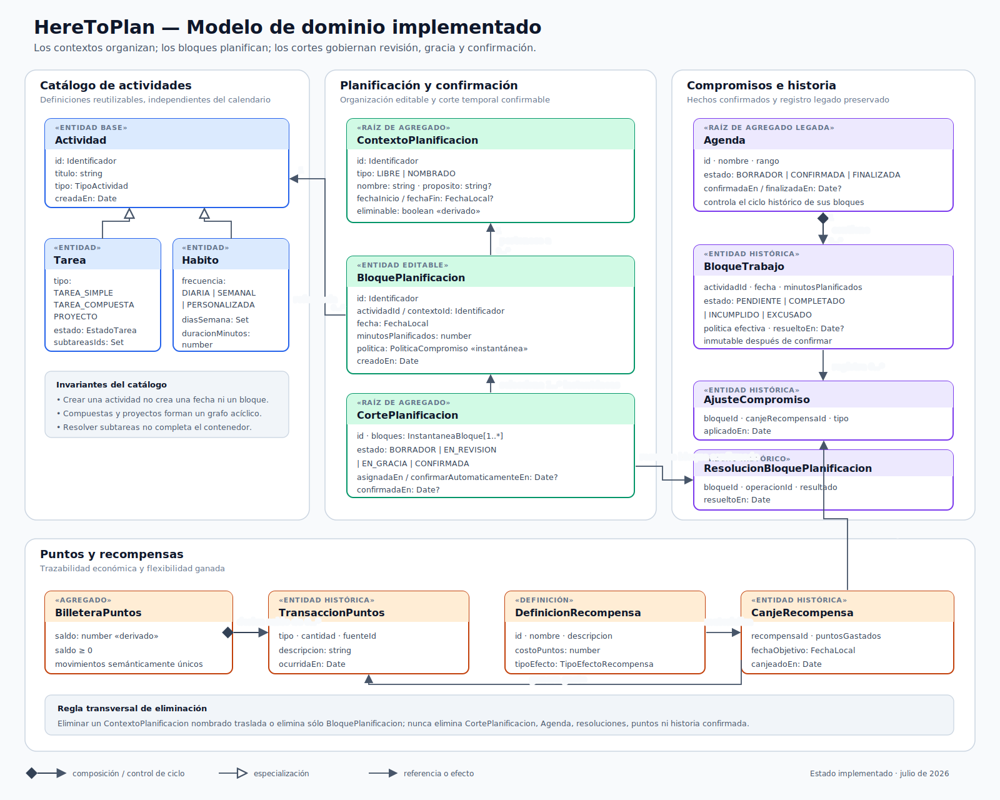

# Contrato del dominio de HereToPlan

El siguiente modelo ofrece una vista resumida de las entidades y relaciones implementadas:



## 1. Propósito del modelo

El modelo parte de una regla central del producto:

> Un bloque de trabajo incluido en un corte de planificación confirmado es un compromiso. No puede borrarse ni alterarse libremente. Solo puede completarse, incumplirse o recibir un ajuste autorizado por una recompensa si fue declarado flexible desde el principio.

Este contrato define cómo deben coexistir los compromisos, los puntos y las recompensas. Su alcance crecerá junto con el producto sin debilitar la trazabilidad ni las invariantes aquí establecidas.

## 2. Módulos

```text
dominio/
├── actividades/
├── agendas/
├── contextos/
├── compromisos/
├── cronometro/
├── planificacion/
├── perfil/
├── puntos/
├── recuperacion/
├── recompensas/
└── compartido/
```

### `perfil`

`PerfilUsuario` representa la identidad local mínima de la persona dentro de
la aplicación. Conserva un identificador estable, un nombre visible y los
instantes de creación y actualización. No representa una cuenta remota, una
sesión autenticada ni autorización.

El nombre se normaliza eliminando espacios exteriores, admite Unicode y no
puede quedar vacío ni superar 60 puntos de código. Actualizarlo produce una
nueva instancia con la misma identidad y creación; el nuevo instante no puede
ser anterior a la creación. La ausencia de perfil es válida y se expresa fuera
de la entidad como `undefined`, nunca mediante un nombre vacío ficticio.

### `actividades`

Contiene `Actividad`, la definición común de aquello que el usuario desea realizar. El contrato distingue `TAREA_SIMPLE`, `TAREA_COMPUESTA`, `PROYECTO` y `HABITO`; las reglas particulares de composición y recurrencia se incorporan sobre esta clasificación sin mezclar la actividad con su programación.

La actividad no se calendariza directamente. Sus ejecuciones concretas se representan mediante bloques de trabajo, permitiendo que un hábito o una tarea produzcan varios compromisos temporales. Una tarea conserva además su propio estado de resultado; resolver un bloque no completa silenciosamente la tarea contenedora.

El catálogo de actividades posee persistencia independiente de las agendas. Crear una actividad no crea un bloque ni le asigna una fecha. La consulta `Sin programar` es una proyección de aplicación: devuelve las actividades cuyo identificador no aparece en ningún bloque existente.

Editar una definición conserva su identificador y fecha de creación. Una tarea
conserva además su estado y sus subtareas; la edición no permite convertir una
tarea en hábito ni un hábito en tarea. Una actividad solo puede eliminarse si no
está referenciada por agendas, bloques editables o cortes históricos.

`Tarea` especializa `Actividad` con estimación necesaria, fecha límite opcional, estado y composición. Una tarea simple no admite subtareas; las tareas compuestas y los proyectos forman un grafo dirigido acíclico. Terminar sus subtareas no completa automáticamente la tarea contenedora: su resolución requiere una decisión explícita y queda fechada.

`Habito` especializa `Actividad` con frecuencia `DIARIA`, `SEMANAL` o `PERSONALIZADA`. Los días utilizan numeración ISO de 1 —lunes— a 7 —domingo—. Una frecuencia semanal declara exactamente un día y una personalizada al menos uno. `correspondeA(fecha)` calcula determinísticamente si debe proponerse una ocurrencia, pero cada ocurrencia real continúa siendo un bloque independiente.

### `contextos`

`ContextoPlanificacion` organiza el calendario sin constituir una promesa. Existen dos clases:

- `LIBRE`, con identidad estable administrada por el sistema, sin rango cerrado y no eliminable;
- `NOMBRADO`, creado por el usuario con nombre, propósito textual opcional y rango completo opcional.

El contexto no contiene bloques, estados de confirmación ni horizontes de visualización. Día, semana y mes pertenecen a las proyecciones de lectura. Un contexto nombrado puede representar un semestre, un proyecto con fechas o un período abierto sin modificar la semántica de los compromisos.

El propósito se normaliza eliminando espacios exteriores; un valor vacío equivale a no declararlo y su extensión máxima es de 240 caracteres. `Libre` no admite propósito editable porque su significado es estable y pertenece al sistema.

Editar un contexto nombrado conserva su identidad y creación y vuelve a validar
nombre, propósito y rango completo. `Libre` tampoco puede editarse a través de
este comando: su identidad y significado pertenecen al sistema.

### `planificacion`

`BloquePlanificacion` representa una asignación temporal todavía editable. Une
explícitamente una actividad y un contexto con una fecha civil, minutos
planificados y una política efectiva versionada. Crear una actividad no crea un
bloque; por ello una tarea, proyecto o hábito puede existir en `Sin programar`
sin ocupar una fecha del calendario.

El bloque editable conserva el título utilizado al asignarlo y la política
efectiva, pero no posee estados de resolución ni confirmación.
`CortePlanificacion` selecciona explícitamente uno o más bloques, copia sus datos
y gobierna la revisión, la gracia y la confirmación sin convertir el contexto
visible completo en una promesa. Esa instantánea queda aislada de cambios
posteriores en el bloque editable.

La revisión de una selección es una consulta sin efectos: valida su vigencia y
produce el resumen que decide la persona. Solo la asignación aceptada crea y
persiste el corte. Desde ese instante, los bloques incluidos no admiten edición
ni eliminación individual durante la gracia; cualquier corrección debe operar
sobre el corte completo y volver a someter su nueva selección a revisión.

Reglas del bloque editable:

1. referencia una actividad y un contexto existentes;
2. si el contexto posee rango, su fecha debe pertenecer a él;
3. los minutos son un entero positivo;
4. su política efectiva es estricta o flexible y conserva autoridad y ajustes;
5. agregar, editar o quitar el bloque no modifica la definición de la actividad;
6. quitar el último bloque devuelve la actividad a la proyección `Sin programar`.

Estados del corte confirmable:

```text
BORRADOR → EN_REVISION → EN_GRACIA → CONFIRMADA
    ↑           │             │
    └───────────┘             └── corregir antes del vencimiento
```

`BORRADOR` es el único estado que admite reemplazar la selección. Iniciar la
revisión exige al menos un bloque; volver desde revisión no crea instantes
temporales. `asignar(instante)` inicia una gracia de diez minutos y fija
`confirmarAutomaticamenteEn = asignadaEn + 10 minutos`. La cuenta regresiva no
es autoridad: `actualizarSegunReloj(instante)` confirma al alcanzar el límite
exacto y registra como confirmación el vencimiento previsto, aunque la
materialización ocurra después de una recarga.

La corrección solo es válida antes del vencimiento. Devuelve el corte a
`BORRADOR`, cancela los instantes de asignación y confirmación prevista y obliga
a revisar nuevamente. Los bloques quedan editables, pero una asignación posterior
reutiliza la identidad del corte y reemplaza sus instantáneas con el estado
revisado. Al alcanzar `CONFIRMADA`, la selección y sus instantáneas son
inmutables. La rehidratación rechaza estados sin los instantes requeridos, gracias
distintas de diez minutos y confirmaciones que no coincidan con el vencimiento
previsto.

`ResolucionBloquePlanificacion` registra el desenlace humano de una instantánea
incluida en un corte confirmado. Es un hecho histórico independiente del bloque
editable: conserva `bloqueId`, `operacionId`, resultado `COMPLETADO` o
`INCUMPLIDO` e instante de resolución. Esta separación permite eliminar el
contexto organizativo sin perder el compromiso ni su resultado.

Un bloque confirmado admite como máximo una resolución y un identificador de
operación sólo puede designar un comando. Repetir exactamente el mismo comando
devuelve la resolución original sin volver a escribir ni sustituir su instante;
usar otra operación sobre el bloque resuelto, o reutilizar la operación para
otro bloque o resultado, produce un conflicto explícito. El reloj sólo se
consulta al crear el hecho por primera vez.

Completar produce además un ingreso de puntos cuya fuente semántica es el
identificador del bloque. Resolución e ingreso se confirman como una sola
operación: no existe un cumplimiento acreditado sin su movimiento ni un
movimiento atribuible a un bloque que haya quedado pendiente. Marcar incumplido
solo registra la resolución; no crea gasto, saldo negativo ni deuda.

### `agendas`

La implementación disponible contiene `Agenda` y `BloqueTrabajo`.

- `Agenda` es la raíz del agregado: crea y conserva los bloques, confirma la planificación y controla sus cambios.
- `BloqueTrabajo` es el compromiso concreto y puntuable.

La agenda solo permite agregar o quitar bloques mientras está en `BORRADOR`. Al confirmarse, queda bloqueada. Los bloques internos no se exponen; `listarBloques()` devuelve vistas independientes para impedir modificaciones externas.

Esta forma todavía concentra dos responsabilidades en `Agenda`: organizar un rango visible y controlar la confirmación de sus bloques. La nueva frontera de dominio las separa en `ContextoPlanificacion` y `CortePlanificacion`; la persistencia y los casos de uso de la `Agenda` legada se conservan hasta introducir una migración explícita. El tipo legado no debe ampliarse suponiendo que una agenda nombrada completa es siempre la unidad confirmable.

Estados de la agenda:

```text
BORRADOR → CONFIRMADA → FINALIZADA
```

Estados de un bloque:

```text
PENDIENTE → COMPLETADO
          → INCUMPLIDO
          → EXCUSADO mediante ajuste autorizado
```

#### Frontera de planificación

| Concepto                        | Datos propios                                                                                                  | Responsabilidad                                                                  |
| ------------------------------- | -------------------------------------------------------------------------------------------------------------- | -------------------------------------------------------------------------------- |
| `ContextoPlanificacion`         | identificador, clase `LIBRE` o `NOMBRADO`, nombre, propósito, rango personalizado opcional y fecha de creación | Organizar y filtrar el calendario sin constituir por sí mismo una promesa        |
| `BloquePlanificacion`           | identificador, actividad, contexto de origen, fecha local, minutos y política efectiva                         | Situar de manera editable una actividad en una fecha concreta                    |
| `BloqueTrabajo`                 | identificador, actividad, fecha local, minutos, política efectiva y estado                                     | Conservar el compromiso individual dentro de una planificación confirmable       |
| `CortePlanificacion`            | identificador, instantáneas seleccionadas, estado, creación, asignación, vencimiento y confirmación            | Controlar qué conjunto atraviesa revisión, gracia y confirmación como una unidad |
| `ResolucionBloquePlanificacion` | bloque confirmado, operación, resultado e instante                                                             | Conservar el desenlace humano como hecho histórico idempotente                   |
| Vista de calendario             | rango visible, filtros y proyecciones diaria, semanal o mensual                                                | Presentar datos; no introduce estados ni horizontes nuevos en el dominio         |

Reglas de la frontera:

1. `Libre` existe por decisión del sistema, no posee un final natural y no puede eliminarse.
2. Una agenda nombrada es un contexto opcional y admite rangos como un semestre o un proyecto.
3. Día, semana y mes son proyecciones de lectura; no son tipos obligatorios de agenda.
4. Un bloque pertenece a un contexto, pero solo se vuelve inmutable al incorporarse a un corte confirmado.
5. Un contexto puede continuar recibiendo planificación futura aunque contenga bloques históricos confirmados.
6. Eliminar un contexto nombrado nunca elimina historial confirmado; la planificación no confirmada se traslada a `Libre` o se elimina mediante una decisión destructiva independiente.

La eliminación se decide sobre una fotografía explícita del impacto: cantidad
de actividades, bloques editables y registros confirmados vinculados. Esa
fotografía posee una huella de concurrencia; si el estado cambia antes de
confirmar, la operación se rechaza completa y debe consultarse nuevamente. La
identidad `Libre` permanece protegida incluso cuando la solicitud no procede de
la interfaz.

Los registros históricos de una agenda eliminada conservan su identidad y sus
metadatos en el almacén legado. La proyección de calendario puede mostrarlos
como procedentes de una agenda eliminada, pero no los reasigna ni reescribe su
origen para aparentar que pertenecían a `Libre`.

### `compromisos`

Contiene `PoliticaCompromiso` y `AjusteCompromiso`.

`PoliticaCompromiso` se asigna a cada bloque antes de confirmar la agenda. Distingue:

- rigidez `ESTRICTO` o `FLEXIBLE`;
- autoridad de plazo `PERSONAL` o `EXTERNA`;
- ajustes permitidos.

Un compromiso estricto no admite ajustes. Un plazo externo no puede declarar `EXTENDER_PLAZO` como ajuste permitido.

Agenda y actividad pueden proponer políticas predeterminadas. La política efectiva se resuelve con precedencia explícita del bloque, actividad y agenda. El bloque recibe una copia independiente antes de confirmarse; su vista incluye `versionEsquema: 1` y se persiste como instantánea histórica. Cambiar posteriormente una propuesta no modifica bloques existentes.

`AjusteCompromiso` registra la autorización histórica que modifica un bloque.
`EXCUSAR` se utiliza en el Día libre. `REDUCIR_CARGA` posee un contrato
especializado, `ReduccionCarga`, porque además de la autorización debe conservar
la cantidad exacta y enlazarse con un consumo del banco de recuperación. Los
tipos `REPROGRAMAR` y `EXTENDER_PLAZO` todavía no poseen comportamiento.

### `cronometro`

`SesionCronometro` registra medición temporal opcional para un bloque
confirmado. Sus estados son `ACTIVA`, `PAUSADA` y `FINALIZADA`; las transiciones
válidas son iniciar, pausar, reanudar y detener. Una sesión finalizada no se
reabre.

La sesión conserva operaciones identificadas y fechadas, no segundos
acumulados. Los intervalos se derivan de la secuencia y la duración efectiva se
calcula como la suma de cada tramo activo. Por ello suspender la pestaña o
recargar la aplicación no altera la medición. Una orden idéntica es idempotente;
reutilizar su identificador para otra transición se rechaza.

Sólo puede existir una sesión abierta en la aplicación, aunque esté pausada.
Cada bloque puede acumular varias sesiones finalizadas. Detener una sesión no
crea una `ResolucionBloquePlanificacion`: completar o incumplir sigue siendo una
declaración humana separada y el cronómetro nunca es obligatorio.

### `recuperacion`

La recuperación es una economía de minutos separada de los puntos.
`MovimientoRecuperacion` registra una `ACREDITACION` o un `CONSUMO`, conserva
una operación idempotente y referencia el bloque que originó el hecho.
`BancoRecuperacion` reconstruye su saldo desde esos movimientos; el saldo no se
persiste como un contador mutable ni puede ser negativo.

Una acreditación sólo puede provenir de un bloque confirmado y completado. Se
calcula con sesiones `FINALIZADA` y usa la carga efectiva del bloque:

```text
excedente = max(0, minutos cronometrados - carga efectiva)
acreditación = min(floor(excedente × tasa), capacidad diaria, capacidad semanal)
```

La configuración inicial utiliza una tasa racional `1:2`, un máximo diario de
120 minutos y uno semanal de 300. Estos valores están encapsulados en
`ConfiguracionRecuperacion`: son parámetros explícitos y calibrables, no una
política definitiva oculta en la interfaz. Las fracciones se redondean hacia
abajo para no acreditar tiempo no verificado.

`ReduccionCarga` registra cuántos minutos se descuentan de un bloque futuro,
pendiente, flexible y cuya política permita `REDUCIR_CARGA`. No reescribe
`minutosPlanificados`: la proyección calcula
`carga efectiva = minutos planificados - minutos reducidos`, conservando así la
estimación original para auditoría. Debe quedar al menos un minuto de carga; una
exención completa pertenece a la regla de Día libre.

Movimiento de consumo y reducción se confirman en una única transacción. La
persistencia vuelve a calcular el saldo y comprueba que el bloque continúe
pendiente antes de publicar ambos hechos. Los índices únicos impiden reutilizar
una operación, acreditar dos veces un bloque o aplicar más de una reducción al
mismo bloque. Los topes también se revalidan dentro de la transacción de
acreditación para tolerar dos pestañas concurrentes.

### `puntos`

`BilleteraPuntos` deriva su saldo desde `TransaccionPuntos`.

`FormulaPuntosBloque` calcula el ingreso inicial exclusivamente desde los
minutos planificados conservados en la instantánea confirmada:

```text
puntos = min(4, ceil(minutos planificados / 30 minutos))
```

La unidad resultante es un punto entero. Los parámetros `30 minutos/punto` y
`4 puntos/bloque` son configuración explícita, no constantes dispersas. Ejemplos
de frontera: 1–30 minutos producen 1 punto; 31–60, 2; 91–120, 4; una duración
mayor continúa limitada a 4. Solo `COMPLETADO` invoca la fórmula.

Reglas:

- el saldo nunca puede ser negativo;
- una transacción no puede repetirse;
- una misma fuente semántica no puede otorgar o consumir puntos dos veces;
- el saldo consultado se reconstruye desde el historial versionado y no se
  persiste como un valor independiente;
- completar e ingresar puntos se confirman juntos o no se confirma ninguno;
- incumplir produce cero movimientos y nunca genera deuda.

### `recompensas`

Contiene:

- `RecompensaDefinida`: describe una recompensa, su costo y efecto;
- `RecompensaAdquirida`: representa una unidad comprada, disponible o
  consumida, con costo histórico e identidad propios;
- `AplicacionRecompensa`: conserva el uso confirmado de una unidad, su fecha y
  sus bloques afectados;
- `CanjeRecompensa`: conserva el contrato legado que compraba y aplicaba en el
  mismo hecho;
- `ServicioCanjeRecompensas`: conserva el contrato de las agendas legadas;
- `ServicioDiaLibrePlanificacion`: evalúa instantáneas de cortes confirmados y
  prepara el canje del modelo de planificación vigente.

La adquisición nueva publica conjuntamente una unidad disponible y su gasto.
No selecciona fecha ni altera bloques. El servicio legado no muta agendas ni
billeteras y devuelve:

1. el canje;
2. la transacción de gasto;
3. los ajustes agrupados por agenda.

La capa de aplicación persiste esos hechos mediante una unidad de
trabajo. El canje, el gasto y todos los ajustes se publican juntos o ninguno se
vuelve visible.

## 3. Regla del día libre

La recompensa `DIA_LIBRE`:

- requiere saldo suficiente al adquirir una unidad;
- adquirirla no selecciona fecha ni modifica compromisos;
- solo puede aplicarse para una `FechaLocal` posterior al día local actual;
- solo considera instantáneas pertenecientes a cortes confirmados;
- afecta todos los bloques pendientes de la fecha seleccionada cuya política
  sea flexible, esté bajo autoridad `PERSONAL` y permita `EXCUSAR`;
- no elimina los bloques;
- registra cada bloque como `EXCUSADO` mediante un `AjusteCompromiso`;
- conserva intactos los compromisos estrictos y los plazos de autoridad
  `EXTERNA`;
- una aplicación sin bloques elegibles se rechaza sin consumir la unidad.

## 4. Invariantes fundamentales

1. Un corte de planificación confirmado no vuelve a ser editable.
2. Un bloque confirmado nunca se elimina del historial.
3. La flexibilidad se decide antes de confirmar la agenda.
4. Un bloque resuelto no admite otra operación; repetir la operación original es idempotente.
5. Un bloque estricto no puede excusarse.
6. Todo bloque excusado debe tener un ajuste asociado a un canje.
7. La agenda controla sus bloques internos y solo expone vistas.
8. El saldo de puntos nunca es negativo.
9. El mismo hecho no genera dos movimientos de puntos.
10. Un canje no altera el estado hasta que la capa de aplicación aplica su resultado.
11. Sólo existe una sesión de cronómetro abierta y cada transición conserva orden temporal.
12. Detener el cronómetro no resuelve ni acredita un bloque.
13. Un bloque completado sólo acredita una vez sus minutos excedentes finalizados.
14. Los puntos y los minutos de recuperación nunca se intercambian entre sí.
15. Consumir recuperación y registrar la reducción de carga son una sola operación atómica.
16. Una reducción conserva los minutos originales y sólo altera la carga efectiva proyectada.
17. Existe como máximo un perfil local y una actualización nunca cambia su identidad ni su instante de creación.
18. Adquirir una recompensa y aplicarla son hechos distintos.
19. Una adquisición publica la unidad disponible y su gasto juntos o no publica ninguno.
20. Una unidad consumida identifica exactamente una aplicación y nunca vuelve a estar disponible.
21. Un canje histórico migra como unidad consumida, nunca como unidad disponible.

## 5. Capacidades todavía no implementadas

El modelo y sus adaptadores aún deben incorporar:

- reglas internas de tareas compuestas y proyectos;
- recurrencia completa de hábitos;
- plantillas de agenda;
- extensión de plazos;
- calibración de la fórmula con observaciones de uso;

Estas capacidades forman parte de la evolución prevista. Su diseño definitivo puede ajustarse a partir de la evidencia obtenida durante el uso del producto.

## 6. Evolución del modelo

La base permite crecer sin romper la regla central:

- nuevos tipos de actividad pueden añadirse sin cambiar el bloque;
- contexto de calendario y corte confirmable evolucionarán como conceptos separados;
- nuevos ajustes pueden implementarse dentro de `BloqueTrabajo.validarAjuste`;
- nuevas recompensas pueden producir otros tipos de ajuste;
- la capa de aplicación coordina transacciones atómicas entre agregados;
- infraestructura rehidrata perfil, agendas, billeteras, inventario,
  aplicaciones, canjes, ajustes, sesiones y movimientos de recuperación
  mediante registros versionados;
- las vistas de los agregados pueden convertirse en DTO persistibles.

La evolución se entiende como capacidad de extensión controlada, no como implementación anticipada de todas las funciones.
